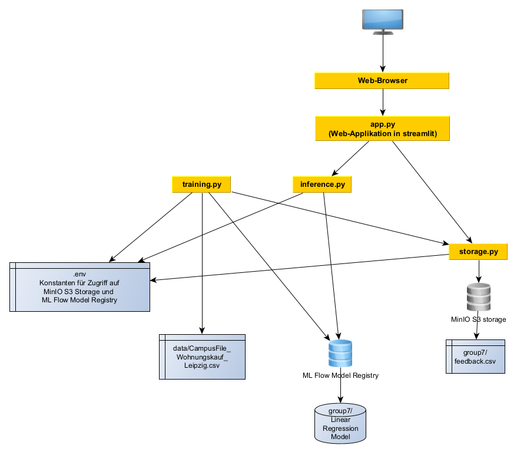

> IMPORTANT

> Gitlab project. Only reupload! CI/CD pipeplines cannot run here. Project cannot be built.
> Data,.env, kubeconfig, ingress.yaml are not puplic. 

# SE4AI, Gruppe 7, Wohnungspreisschätzer für Leipzig

Vorlesung zu "Software Engineering for AI-enabled systems", Universität Leipzig, Sommersemester 2022, Projekt 02, Gruppe
07

Präsentationsfolien der Kurzvorstellung: [Google Presentation](https://docs.google.com/presentation/d/1Xq26z48hcNJOW34J_xeMqvJ2SMWkh0CMfUGUbGH_cEk/edit?usp=sharing)

Finale Präsentation des 2. Projektes: [Google Presentation](https://docs.google.com/presentation/d/1JnMAfBGE36CvU2e279T6Kt5ObXdnhuNmy24hTOpgXns/edit#slide=id.g144acfaf0f0_0_115)

## Group Members

- Jonas Greim, student in Master Computer Science
- Cuong Vo Ta, student in Master Computer Science
- Ralf König, student in Master Data Science

## GUI (Web Applikation)

### GUI (Web Applikation) nutzen

https://t7.se4ai.sws.informatik.uni-leipzig.de/ - Zur Webapplikation auf dem Kubernetes-Cluster der Professur
Softwaresysteme der Uni Leipzig.

### GUI (Web Applikation) lokal ausführen

```bash
docker-compose up
```

oder

```bash
cd se4ai-2022-7
pip install -r requirements.txt
# if streamlit is on $PATH
streamlit run app.py  
# else
python -m streamlit run app.py
```

Dann im Browser verbinden mit der lokalen URL des Streamlit-App-Servers: http://localhost:8501

**Wichtig:** auch in der lokalen Ausführung behält die App aber die Abhängigkeit von den von SWS bereitgestellten 
Diensten wie ML Flow Model Registry und MinIO S3 Storage.

## Übersicht über die Architektur



## Machine Learning-Funktionen im Ordner ``apartment_price_estimate/``

## Ausgangsdaten

Ausgangsdaten für das Training sind Daten von Verkaufsanzeigen von Eigentumswohnungen von ImmobilienScout24.de. Diese
haben wir nach einiger Kommunikation mit ImmoScout24 dann über das Leibniz-Institut für Wirtschaftsforschung (RWI) in
Essen bekommen als Public Use File für die Anwendung in der Lehre. Dort gab es auch Verkaufsanzeigen von
Eigentumswohnungen der 15 größten Städte in Deutschland, aber in anonymisierter Form. Diese Dateien liegen in `data`. In
der Datei [``CampusFile_Wohnungskauf_Leipzig.csv``](data/CampusFile_Wohnungskauf_Leipzig.csv) haben wir gleich nur noch
den Auszug für Leipzig gespeichert, was über einen Gemeindeschlüssel ableitbar war. Die Datenbeschreibung dazu ist
in [``Datenbeschreibung-city-and-cross.pdf``](data/Datenbeschreibung-city-and-cross.pdf).

### training.py

Dieses Modul trainiert ein lineares Regressionsmodell mit der Vorhersage-Variable des Kaufpreises basierend auf 9
Eingabevariablen.

#### Quelldaten einlesen

* Einlesen der [``CampusFile_Wohnungskauf_Leipzig.csv``](data/CampusFile_Wohnungskauf_Leipzig.csv) und Filtern auf
  relevante Jahre, die sich dort einstellen lassen. Voreinstellung ist "ab 2020". Da die Immoscout24-Daten Daten der
  letzten 12 Jahre enthalten und alte Daten die Preisvorhersage beeinflussen würden, ist dieser Filter dort setzbar.

#### Quelldaten und ihre Verteilungen visualisieren

* Plotten von Diagrammen, um Zusammenhänge zu visualisieren, siehe [Plots auf den Eingangdaten](plots.md).

#### Feedback einbeziehen

Mit der Kommandozeilenoption "-f" können die Feedback-Daten aus der ``feedback.csv`` auf dem S3-Storage einbezogen
werden, wenn das gewünscht ist. Diese werden dann den Trainingsdaten hinzugefügt.

#### Daten bereinigen und imputieren

* Die Daten von Immoscout24 haben recht viele "NAs" (not available = nicht verfügbare Angaben) auf einzelnen
  Datenfeldern, gerade wie Aufzug, Balkon, Parkplatz. Dies waren dann optionale Angaben, wo die Ersteller der
  Verkaufsanzeigen keinen Wert auswählen mussten. Auch das Feld
  ``energieeffizienzklasse`` ist nur sehr spärlich befüllt, weil es lange keine Pflicht war. Mit den NAs kann aber das
  Modell nicht trainiert werden.
* Bereinigung der Daten und Imputation: da das LinearRegression-Modell keine NAs verarbeitet, gab es  
  prinzipiell zwei Möglichkeiten:
    1) Datenzeilen löschen, die unvollständige Angaben haben.
    2) Datenwerte "NA" mit einem halbwegs plausiblen Wert ersetzen, um aus unvollständigen Angaben dann vollständige zu
       machen.

  Mit dem Weg i) würden sehr viele der 2700 Anzeigen sind, die auf Leipzig und 2020/2021 passen. Also haben wir uns
  zwangsläufig für den Weg ii) entschieden und NAs durch den Mittelwert der vorhandenen Werte ersetzt. Das ist ein
  "Missing Completely at Random"-Vorgehen, das streng genommen hier nicht angewendet werden sollten, weil
  "Missing Completely at Random" mit hoher Wahrscheinlichkeit nicht vorliegt, sondern das Vorhandensein von NA  
  abhängig ist vom Wert selbst (Missing not at random - schlechte Energieeffizienz einer Wohnung wird halt nicht gern
  kommuniziert) und auch von anderen Variablen im gleichen Datensatz (Missing at random, z.B. Alter der Anzeige bestimmt
  die Pflicht zur Nennung der Energieeffizienzklasse oder bei einer 1-Zimmer-Wohnung ist es halt nicht sinnvoll, die
  Anzahl der Schlafzimmer und Badezimmer anzugeben).

#### Training des Modells

Zum Schluss werden die Daten in die eine Vorhersagevariable `kaufpreis` und die neun Eingangsfeatures (Anzahl Räume,
Wohnfläche, Anzahl Schlafzimmer, Anzahl Badezimmer, Aufzug vorhanden, Balkon vorhanden, Denkmalobjekt, Parkplatz
vorhanden, Energieeffizienzklasse) aufgeteilt und damit das Modell trainiert. Das trainierte Modell kann entweder in
einer Datei oder auf dem ML Flow Model Storage abgelegt werden. Auf dem ML Flow Model Storage wird es nicht gleich
aktiv, sondern nur die höchste Version in der Phase "Production" wird aktiv. Das lässt sich über
die [Nutzeroberfläche des ML Flow Model Servers](https://mlflow.sws.informatik.uni-leipzig.de/) steuern.

### inference.py

Dieses Python-Modul kapselt die Anwendung des ML-Modells, also das Laden des trainierten Modells und dann die Vorhersage
auf dem Modell. Es verbindet sich dazu mit dem ML Flow Model Server, um das aktuellste Modell aus der Phase "Production"
zu laden. Dann nimmt es Vektoren von Wohnungseigenschaften entgegen und macht damit die Vorhersage auf einen ganzen
Euro-Betrag.

## Cloud-Storage-Funktionen

### storage.py

Dieses Python-Modul kapselt das Wegspeichern und Holen von einem S3-kompatiblen Cloud-Speicher für die ``feedback.csv``,
die als Tabelle für das Sammeln des Feedbacks dient. Von uns wird das MinIO genutzt, das von SWS bereitgestellt und
empfohlen wurde.

## GUI-Funktionen

Alle GUI-Funktionen sind in ``app.py`` enthalten.

* app.py lädt beim Start zunächst einmalig das Modell aus dem Model Store des ML Flow-Server und da die aktuelle Version
  aus der Phase "Production".
* im Zustand ``get_input`` werden Eingabemöglichkeiten bereitgestellt für 9 Eigenschaften einer Wohnung. Ändert sich
  etwas an diesen Eingaben, so wird der Schätzpreis dynamisch immer gleich mit aktualisiert. Dafür nutzt ``app.py`` dann
  die Funktionen von ``apartment_price_estimate/inference.py`` auf dem Model, das vorher geladen wurde.
* Der Nutzer oder die Nutzerin bekommt dann die Möglichkeit, sein Feedback zu geben: ob sie oder er den Preis als
  Schätzpreis realistisch findet relativ zu den eingestellten Eigenschaften. In beiden Fällen "Ja", wie auch "Nein"
  wird dann Feedback weggespeichert als Satz der Eigenschaften und des Preises. Bei "Ja" mit dem Preis der Schätzung,
  bei Nein kann man einen neuen Preis in Tausend EUR einstellen. Zum Wegspeichern in eine CSV auf einem S3-Bucket
  greift ``app.py`` auf die Funktionen von ``storage.py`` zurück. Das Feedback wird dort angehängt.
* Nach dem Feedback kommt man wieder auf die Startseite. Der Zustand wird zurückgesetzt auf Ausgangswerte.
* ``app.py`` speichert seinen Zustand in einzelnen Sitzungszustand-Variablen (session state). Deshalb sind die
  Funktionen als _protected_ gekennzeichnet, weil sie sich von außen nicht sinnvoll nutzen lassen.

## CI/CD-Funktionen auf ``git.informatik.uni-leipzig.de``

Beim Pushen auf den ``master``-Branch werden automatisch in [``.gitlab-ci.yml``](.gitlab-ci.yml) zwei Funktionen
angetriggert:

* Docker Image der gesamten App bauen und in einer Docker-Registry aktualisieren
* das Docker Image dort wieder runterladen und auf dem Kubernetes-Cluster installieren ("deployen") sowie die
  Web-Proxy-Konfiguration

### Variablen im Git-Repository

#### Git-Variablen für DockerHub

`AUTH_DOCKERHUB`
`CI_COMMIT_TAG`
`CI_REGISTRY`
`CI_REGISTRY_IMAGE`
`CI_REGISTRY_PASSWORD`
`CI_REGISTRY_USER` - halten die Umgebungsvariablen für das Einloggen auf dem DockerHub zum Upload des aktuellsten Image
nach dem Build bzw. Download des aktuellsten Image vor dem Deployment.

#### Git-Variablen für Kubernetes

`K8S_CERTIFICATE`
`K8S_SERVER` - werden geerbt von der oberen Gitlab-Ebene.

`K8S_TOKEN` - hält das Token für die Kommunikation mit dem Kubernetes-Cluster-Management.

Die restliche Konfiguration ist in der Datei [``kubeconfig``](kubeconfig).

`HEROKU_API_KEY`
`HEROKU_APP_NAME` - Heroku haben wir zwischendurch dafür genutzt, die Anwendung noch extern auf Heroku zu testen, als
der Kubernetes-Cluster noch nicht voll zur Verfügung stand. Wird jetzt nicht mehr genutzt.

### Docker Image bauen

In [``.gitlab-ci.yml``](.gitlab-ci.yml) in der Stage ``build`` und Job ``build_image`` mit Kaniko weitgehend nach den
Vorschlägen der MitarbeiterInnen des Lehrstuhls Softwaresysteme.

### Deployment auf den Kubernetes-Cluster des Lehrstuhls Softwaresysteme

In [``.gitlab-ci.yml``](.gitlab-ci.yml) in der Stage ``deploy`` und Job ``deploy_to_kubernetes`` weitgehend nach den
Vorschlägen der MitarbeiterInnen des Lehrstuhls Softwaresysteme. Aach ein Web-Proxy-Server wird noch gestartet, der
mit ``nginx`` realisiert ist und eine HTTPS-Konnektivität realisiert. Dafür wird vorher ein Zertifikat von LetsEncrypt
geholt. Auch dies wurde nach den Hinweisen zum zweiten Projekt realisiert.

### Manuell startbare Jobs in Git: Training mit Einbezug des Feedback 

Das Training auf den Daten *mit* Feedback lässt sich über die Web-Oberfläche von Git auch manuell anstoßen. Das ist auch
in  [``.gitlab-ci.yml``](.gitlab-ci.yml) definiert, wird aber bewusst nicht automatisch ausgeführt. Letztlich ist die
Datenqualität der Feedbackdaten höchst unklar, und die Wahrscheinlichkeit hoch, dass damit das Modell eher verfälscht,
als verbessert wird. Bestimmte Eigenschaften des linearen Modells lassen sich mit Trainingsdaten auch gar nicht
ausbessern.
